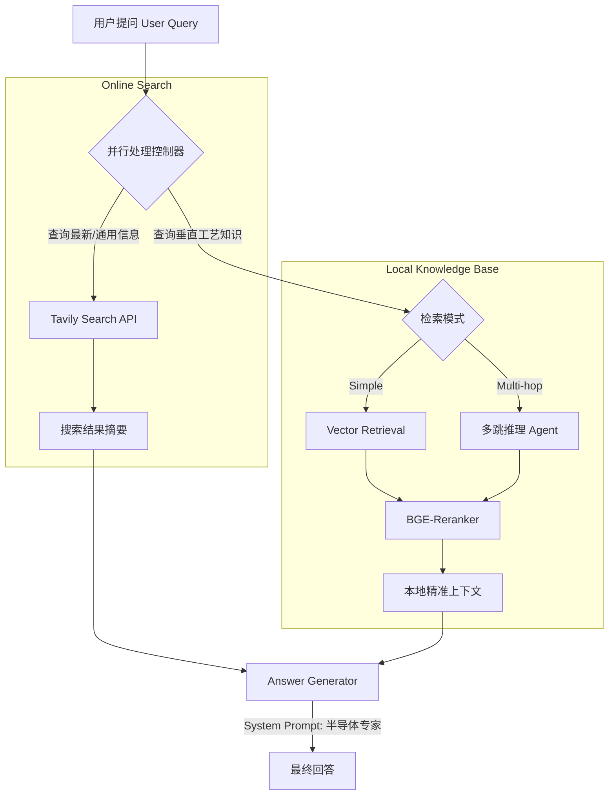

# 🔍 Vertical Domain RAG for Semiconductors

> **Featuring Multi-hop Reasoning & Online Retrieval**

   

## 📖 项目背景 (Background)

在半导体（特别是 **SiC 碳化硅**）研发领域，知识获取面临两大难题：
1.  **私有长尾知识：** 具体的晶体生长工艺（如 PVT 法温度梯度设定）分散在大量文献和实验记录中，通用大模型（GPT-5/DeepSeek）缺乏此类垂直知识。
2.  **知识时效性与复杂性：** 市场行情与最新论文每天更新，且单一问题往往需要跨多个文档推理（Multi-hop Reasoning）才能得出结论。

本项目基于 **api调用** 大模型，构建了一个**具备联网搜索与多跳推理能力的 RAG Agent**，旨在为半导体研发工程师提供精准、实时的技术支持。

## 🚀 核心特性 (Key Features)

### 1. 强推理基座模型 (Robust Reasoning Backbone)
* **基座选型:** 可选用 **Qwen**（通义千问）、**deepseek**等多种大模型作为核心推理引擎，能够更精准地处理 RAG 检索回来的复杂半导体工艺文档，最大限度减少幻觉。

### 2. 多跳推理 (Multi-hop Reasoning)
* 解决了简单 RAG 无法处理的复杂问题。
* **机制：** 将复杂问题拆解。例如：*“对比 PVT 法与 CVD 法在生长 SiC 时的缺陷类型差异”* -> 系统会自动分步检索 PVT 缺陷 -> 检索 CVD 缺陷 -> 汇总对比。

### 3. 联网搜索增强 (Web Search Integration)
* 接入搜索引擎工具（Tavily），当向量库中缺乏相关信息或用户询问最新数据（如 *"2025年 Wolfspeed SiC 产能"*）时，自动触发联网搜索补全上下文。

### 4. 混合检索与重排序 (Hybrid Search & Rerank)
* **Retrieval:** 结合 `BGE-M3` 语义检索 + BM25 关键词匹配。
* **Reranking:** 使用 `BGE-Reranker-v2-m3` 对召回结果进行精排，显著提升 Top-5 准确率。

## 🛠️ 技术架构 (Architecture)
系统采用并行处理架构，同时进行本地知识库检索与联网搜索，最后由 LLM 进行多源信息融合。

## 📂 项目结构 (Project Structure)
```plaintext
Rag-sm/
├── config/             # 配置管理
│   ├── configs.py      # 核心参数配置 (API Key, Model Path, Chunk Size)
│   └── env.py          # 环境变量工具
├── ingest/             # 数据入库模块
│   ├── pdf_loader.py   # PDF 文档加载
│   ├── chunker.py      # 文本切片
│   └── vectorizer.py   # 向量化处理
├── kb/                 # 知识库管理
│   └── kb_manager.py   # 知识库路径与索引管理
├── llm/                # 大模型接口封装
│   ├── llm_client.py   # OpenAI/Dashscope 客户端封装
│   └── embedding_client.py
├── rag/                # RAG 核心逻辑
│   ├── pipeline.py     # 生成管线 (Simple/Multi-hop)
│   ├── service.py      # 并行服务层 (Search + RAG)
│   └── multi_hop_rag.py# 多跳推理实现
├── search/             # 检索模块
│   ├── retriever.py    # 向量检索
│   ├── reranker.py     # 重排序
│   └── web_search.py   # Tavily 联网搜索
├── web_ui/             # 前端界面
│   └── web_ui.py       # Gradio 界面实现
├── main_ui.py          # 程序启动入口
└── requirements.txt    # 项目依赖
```

## 💻 快速开始 (Quick Start)

### 1. 环境准备

建议使用  3.11 环境。

```bash
# 创建虚拟环境
conda create -n rag-sm python=3.11
conda activate rag-sm

# 安装依赖
pip install -r requirements.txt

```
### 2. 配置 API Key

本项目依赖外部模型服务，请在 `config/configs.py` 中配置你的 API Key：

* **LLM & Embedding:** 阿里云百炼 (Dashscope) 或 OpenAI 格式接口。
* **Web Search:** Tavily API。
* **Rerank:** 硅基流动 (SiliconFlow) 或本地模型。

打开 `Rag-sm/config/configs.py` 并修改以下字段：

```python
class Config():
    # Embedding & LLM (阿里云示例)
    api_key = "sk-xxxxxxxxxxxxxx" 
    llm_api_key = "sk-xxxxxxxxxxxxxx" 
    
    # 联网搜索
    tavily_api_key = "tvly-xxxxxxxxxxxx"
    
    # Rerank (硅基流动)
    rerank_api_key = "sk-xxxxxxxxxxxx"
    rerank_model = "BAAI/bge-reranker-v2-m3"
    
    # ... 其他参数
```


### 3. 启动应用
运行主程序启动 Gradio Web 界面：

```bash

python main_ui.py
```
或者pycharm、vscode中运行main_ui.py

终端显示如下信息即启动成功：

* Running on local URL:  http://127.0.0.1:7863

打开浏览器访问该地址即可开始对话。

### 4. 构建知识库 (Ingestion)
1. 点击 "知识库管理" 按钮
2. 输入知识库名称
3. 点击 "创建知识库。
4. 选择要添加文件的知识库
5. 上传 PDF 文档。
6. 等待索引完成


### 5. 对话交互
1. 点击"对话交互" 按钮
2. 选择知识库
3. 勾选是否启用联网搜索、多跳推理和表格输出
4. 提交问题
5. 等待生成回答

**🌐🔍联网搜索展示如下：**
[20251211_130005.mp4](../../../Huawei%20Share/Screenshot/20251211_130005.mp4)
- 会先到知识库中检索，没有结果时，会只使用联网搜索结果进行回答。

- 如果不希望回答参考历史问题，可以清空历史记录再提问。

**🧠👣多跳推理展示如下：**
[20251226_181414.mp4](../../../Huawei%20Share/Screenshot/20251226_181414.mp4)


启用多跳推理，速度会慢一些。

## 📝 TODO RoadMap
### 🚀 In Progress (进行中)
- [x] ⏫ **架构重构与升级 (Architecture Evolution)**
    - 集成 **LlamaIndex** 与 **LangChain/LangGraph** 生态，迁移至 **Qdrant** 向量数据库。
    - 构建标准化 API 接口与缓存层 (Caching Layer)，显著降低 Token 消耗并提升响应效率。
- [x] 📄 **多模态文档解析 (Multi-format Parsing)**
    - 扩展支持 Markdown, Docx, Excel 等多种格式入库。
    - 针对半导体领域特有的复杂表格与公式，优化解析算法，确保清洗后的文本质量。
- [x] 📊 **深度上下文提取 (Deep Context Extraction)**
    - 增强对 **LaTeX 复杂公式** 及 **跨页表格** 的结构化识别能力，解决专业文档中的信息丢失问题。

### 📅 Planned (规划中)
- [ ] 🤖 **Agentic RAG 增强 (Advanced Agentic RAG)**
    - 引入 **Query Rewriting** (问题重写) 与 **Sub-question Decomposition** (子问题拆解) 机制，提升对模糊及复杂查询的推理能力。
- [ ] 🧠 **长时记忆网络 (Long-term Memory)**
    - 实现对话历史的持久化存储 (Persistence)，支持基于历史上下文的**多轮深度对话**。
- [ ] 🔬 **行业大模型集成 (Vertical Domain LLM)**
    - 部署半导体开源大模型 **SemiKong**，利用行业语料微调，大幅降低专业领域的模型幻觉。
- [ ] 🛡️ **企业级系统管理 (Enterprise Management)**
    - 完善用户注册、登录及 RBAC 权限管理模块。
    - 建立全链路监控告警系统与自动化测试流程，提升系统稳定性。

## 🤝 贡献 (Contributing)
欢迎提交 Issue 和 Pull Request！对于重大的变更，请先开 Issue 讨论。

## 📄 License
This project is licensed under the Apache 2.0 License.
